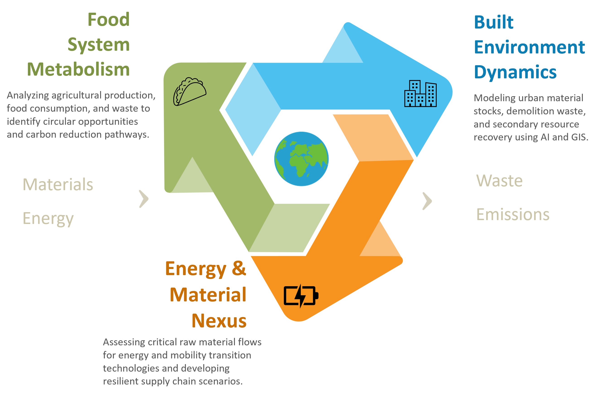

---
---
# **About US**

We are a young and international research group in the [Department of Green Technology](https://www.sdu.dk/en/igt) at the Faculty of Engineering, [University of Southern Denmark](https://www.sdu.dk/en). 

We study the **sustainable transformation** of **socio-economic systems**, with a particular focus on **transport**, **buildings**, **food**, and **energy** systems. Our research seeks to uncover the material and energetic foundations of these systems, providing insights into their systemic dynamics, technological transitions, and environmental implications.

Through close collaboration with academic institutions, industry partners, and policy stakeholders, we aim to serve as a strategic bridge between research, practice, and decision-making. By fostering knowledge exchange, interdisciplinary dialogue, and real-world application, we contribute to shaping more resilient and sustainable futures.



## Highlights



We investigate sustainable transitions across key socio-economic systems—transport, energy, buildings, and food. Our work connects academia, industry, and policy, fostering collaboration and public knowledge exchange through a strong interdisciplinary and cross-sectoral network.









Stay updated with our latest publications, conference highlights, and research insights. Our blog offers a window into the evolving landscape of sustainability science and innovation.









We are a young, vibrant and international team shaped by diverse academic roots—from economics and civil engineering to environmental science, GIS, and computer science. United by a shared vision for sustainability, we bring fresh perspectives and interdisciplinary strength to every challenge.






