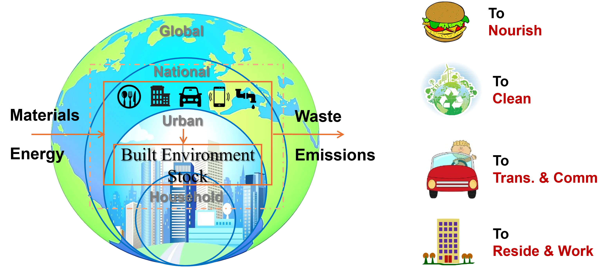

# Research

## Featured Projects

---

### [WINDHY](https://cordis.europa.eu/project/id/101181231/pl): Multi-disciplinary risk management for stable, safe, and sustainable offshore wind-powered hydrogen production
**Duration:** 10.2024-09.2028 
**Funding Type:** Marie Skłodowska-Curie Actions (MSCA) 
**Status:** Ongoing 

**Description:**  
As global demand for clean energy surges, green hydrogen production powered by offshore wind is emerging as a promising solution. However, the path from capturing offshore wind energy to delivering hydrogen safely is not without challenges. With the support of Marie Skłodowska-Curie Actions programme the WINDHY project tackles these by focusing on novel offshore production technologies that convert wind power to hydrogen through electrolysis. Central tasks include refining energy carriers and transport methods whilst addressing the technical and environmental risks. WINDHY unites experts through a staff exchange, global survey, and networking across sectors to assess sustainability, manage risks and strengthen Europe’s renewable energy expertise. This approach promises to make offshore hydrogen production safer and more sustainable. 
**Keywords:** Energy,Wind-powered hydrogen production, Risk prediction, Public acceptance, Emerging technology, Natural disaster triggered accident 

---

### [QuiVal](https://quival-research.eu/): Quantum Inspired Valuation of Circular Real Estate
**Duration:** 09.2024-08.2028 
**Funding Type:** Marie Skłodowska-Curie Actions (MSCA) 
**Status:** Ongoing 

**Description:**  
The real estate industry, a significant contributor to pollution, must reduce its emissions and incorporate environmental and societal values into investment decisions. Currently, there is limited understanding of the value of CO2-neutral real estate throughout its life cycle. With the support of the Marie Skłodowska-Curie Actions programme, the QuiVal project will train professionals to develop an innovative, climate-aware approach to real estate value and valuation. It explores quantum mechanical concepts to pursue circular real estate, aiming to motivate future investments in this sector. The project comprises a collaborative network of PhD projects focused on developing quantum-inspired approaches to valuing buildings for a circular real estate market. 
**Keywords:** Circular built environment, Building stock analysis, Real estate, CO2 neutral   

---

### [TREASoURcE](https://treasource.eu/): Territorial and regional demonstrations of systemic solutions of key value chains and their replication to deploy circular economy
**Duration:** 06.2022-05.2026 
**Funding Type:** Innovation Action (IA) 
**Status:** Ongoing 

**Description:**  
TREASoURcE focuses on demonstrating CE solutions in cities and regions across the Nordics (Finland, Sweden, Norway, and Denmark), with plans to replicate them in the Baltics (Estonia, Latvia, Lithuania), Poland, and Germany (within the Baltic Sea Region). The combination of these cities and regions will enable broad reach and significant impact, enhancing the replicability and scalability potential of the CE solutions. A common issue across the regions is the low and decentralised material volumes, which present feasibility challenges and high-risk investments due to difficulties in securing sufficient feedstock in terms of both quality and quantity. Nevertheless, the regions’ strengths lie in their ambitious climate and environmental targets. 
**Keywords:** Sustainability, Transport 

---

### [WASTELESS](https://wastelesseu.com/): Waste Quantification Solutions to Limit Environmental Stress
**Duration:** 01.2023-12.2025 
**Funding Type:** Horizon Europe? 
**Status:** Ongoing 

**Description:**  
The EU’s transition to a circular economy and more resource efficiency is driven by innovation. This can be seen in the food industry, where there is a shift from linear to circular sustainability. In this context, the EU-funded WASTELESS project will develop and test a mix of innovative tools and methodologies for measurement and monitoring of food loss and waste. The project will follow a bottom-up approach. It will start by defining a harmonised methodological framework. It will then establish the standards for the testing activities, the evaluation of the quality and integrability of the data produced in other frameworks. Lastly, it will recommend sustainable policies and business strategies. The findings will be used to develop a decision support toolbox. 
**Keywords:** Agriculture, Food 

---

