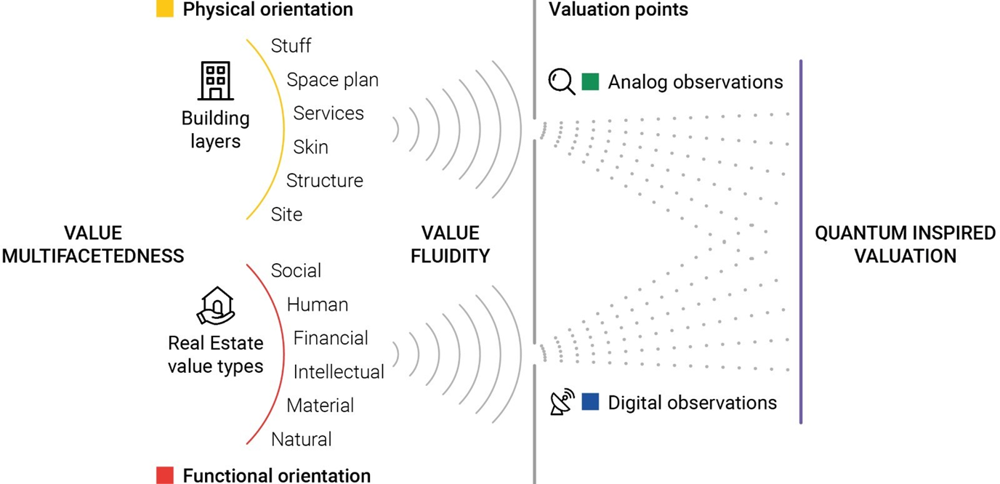
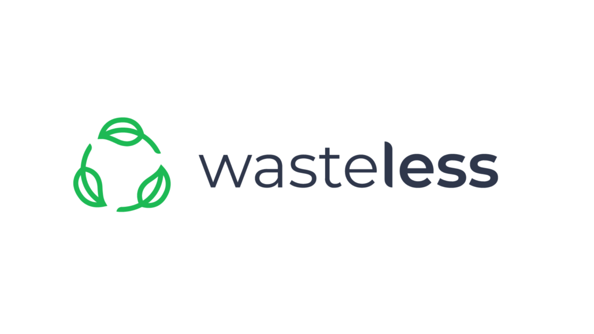

# Research

### EU Foundations

<!-- Windy Project -->

  
  
    <h4>Windy: Multi-disciplinary risk management for stable, safe, and sustainable offshore wind-powered hydrogen production</h4>
    <strong>Duration:</strong> 10.2024–09.2028 (active) 
    <strong>Funding Type:</strong> EU Marie Skłodowska-Curie Actions (MSCA) 
    <strong>Link:</strong> https://cordis.europa.eu/project/id/101181231/pl  
    <strong>Keywords:</strong> Wind-powered hydrogen production, Risk prediction, Natural disaster triggered accident
  

  

    
  

<!-- QuiVal Project -->

  

    <h4>QuiVal: Quantum Inspired Valuation of Circular Real Estate</h4>
    <strong>Duration:</strong> 09.2024–08.2028 (active) 
    <strong>Funding Type:</strong> EU Marie Skłodowska-Curie Actions (MSCA) 
    <strong>Link:</strong> https://quival-research.eu/  
    <strong>Keywords:</strong> Circular Economy, Built environment, Urban metabolism
  

  

    
  

<!-- TREASoURcE Project -->

  

    <h4>TREASoURcE: Territorial and regional demonstrations of systemic solutions of key value chains and their replication to deploy circular economy</h4>
    <strong>Duration:</strong> 06.2022–05.2026 (active) 
    <strong>Funding Type:</strong> EU Innovation Action (IA) 
    <strong>Link:</strong> https://treasource.eu/  
    <strong>Keywords:</strong> Transport, Sustainability development
  

  

    
  

<!-- Wasteless Project -->

  

    <h4>Wasteless: Waste Quantification Solutions to Limit Environmental Stress</h4>
    <strong>Duration:</strong> 01.2023–12.2025 (active) 
    <strong>Funding Type:</strong> EU Horizon Europe 
    <strong>Link:</strong> https://wastelesseu.com/  
    <strong>Keywords:</strong> Agriculture, Food
  

  

    
  

### Regional Foundations

  
<!-- Regenerate Project -->

  

    <h4>Regenerate: A regionalized and just  for Europe: Assessing social-ecological potentials and barriers</h4>
    <strong>Duration:</strong> 09.2025–08.2026 (active) 
    <strong>Link:</strong> https://portal.findresearcher.sdu.dk/en/projects/a-regionalized-and-just-energy-transition-for-europe-assessing-so  
    <strong>Keywords:</strong> Energy transition, Supply chain management
  

  

    
  

<!-- Pig-Green Project -->

  

    <h4>Pig-Green: Exploring the green transformation of the Danish pork supply chain and its contribution to carbon neutrality</h4>
    <strong>Duration:</strong> 04.2025–03.2026 (active) 
    <strong>Link:</strong> https://portal.findresearcher.sdu.dk/en/projects/exploring-the-green-transformation-of-the-danish-pork-supply-chai  
    <strong>Keywords:</strong> Pork supply chain, Carbon neutrality
  

  

    
  

<!-- iBuildGreen Project -->

  

    <h4>iBuildGreen</h4>
    <strong>Duration:</strong> 01.2021–07.2024 (completed) 
    <strong>Link:</strong> https://vbn.aau.dk/en/projects/ibuildgreen/  
    <strong>Keywords:</strong> Building material stock, Circular Economy
  

  

    
  

